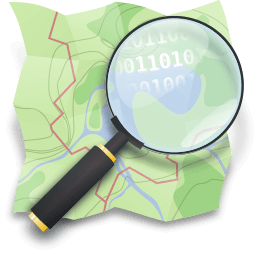

OpenStreetMap is a project founded in 2004 with the goal of creating a free world map. OSM cartographers generate data about roads, railways, rivers, forests, houses and everything else that can be seen on maps. This project aims to overcome the barriers that often exist for commercial geodata, e.g. in terms of usage rights and costs. In 2006, the OpenStreetMap Foundation was founded as a non-profit organization that maintains the infrastructure through donations and other funds ([www.openstreetmap.org](http://www.openstreetmap.org/), [F. Ramm und J. Topf, (2008)](/opendata/vorlesung/literatur#ramm2008openstreetmap)). OSM is essentially shaped by the commitment of its user community. In January 2019, more than 5 million users were registered in the OSM Wiki. Anyone can use the OpenStreetMap data free of charge and process it as they wish.

Technologically, the OSM project consists of four components:
* **Editors** for data input and data maintenance, essentially via GNSS import or by means of own digitizations (e.g. Potlatch as flash-based online editor or JOSM as Java stand-alone application).
* **Database server** e.g. with a MySQL database at University College London. The data can be accessed either directly via OSM-API or in a specific XML file format (*.osm).
* **Map renderers** are responsible for creating the maps. For example, the osmarender generates SVG graphic data from the OSM data. Mapnik is an open source map renderer.
* **Viewers** that are used in the browser to display the OSM map.

In addition to the company's own geodata, free data such as satellite image data or geodata that are not subject to licensing rights are also available. [P. Neis und A. Zipf, 2008](/opendata/vorlesung/literatur#neis2008openstreetmap), discuss the advantages and disadvantages of OSM geodata. Advantages are e.g. world-wide free, partly very special geodata with high topicality and often sufficient accuracy with fast, but uncontrolled growth of the geodata. Disadvantage is the widely varying worldwide coverage and the heterogeneous quality of the geodata with non-uniform semantics and with obstacles due to the license model for enrichment with commercial data.
