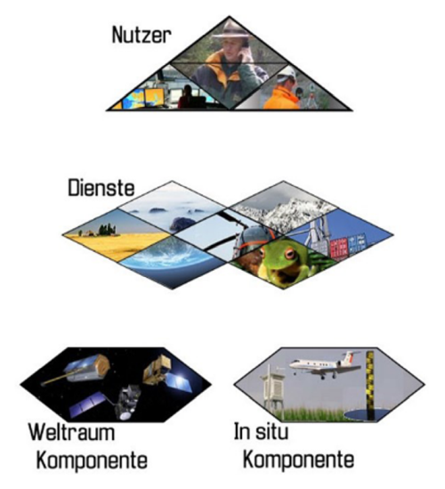

## Das Copernicus-Programm

Das Copernicus-Vorgängerprogramm war das Global Monitoring for Environment and Security (GMES, deutsch: Globale Umwelt- und Sicherheitsüberwachung) welches 1998 von der EU und der ESA ins Leben gerufen wurde. Im Jahr 2012 wurde es dann in Copernicus umbenannt und überführt.

Die Copernicus Kerndienste stellen umfangreiche Grundlageninformationen bereit, die für vielfältige Anwendungen weiter verarbeitet werden können. Die Dienste „Überwachung des Klimawandels“ und „Sicherheit“ befinden sich noch in der Entwicklung.
Das Programm besteht aus den folgenden sechs Kerndiensten:
-	Landüberwachung (Copernicus Land Monitoring Service, CLMS)
-	Überwachung der Meeresumwelt (Copernicus Marine Environment Monitoring Service, CMEMS)
-	Katastrophen- und Krisenmanagement (Copernicus Emergency Management Service, EMS)
-	Überwachung der Atmosphäre (Copernicus Atmosphere Monitoring Service, CAMS)
-	Überwachung des Klimawandels (Copernicus Climate Change Service, C3S)
-	Sicherheit (Copernicus Security)

In dieser Lerneinheit soll der Fokus auf dem Landmonitoring liegen.

 DLR")

! Infos über die Copernicus-Kerndienste finden Sie hier: https://www.d-copernicus.de/daten/daten-eu-kerndienste/  
  

Im Rahmen von Copernicus gibt es im Grunde vier Projektkomponenten: zum einen die __(i)__ Satelliten und beitragenden Missionen sowie das Bodensegment, zum anderen die nationalen **(ii)** in-situ Messnetze. Hinter der in-situ Komponente verbergen sich alle Daten, die nicht aus dem Weltraum gewonnen wurden (außer Daten wie z.B. SRTM). Darauf aufbauend operieren die __(iii)__ sechs thematischen Dienste, die durch Fachagenturen wie die Europäische Umweltagentur (EEA) umgesetzt werden. Die daraus resultierenden Informationen werden zusammengetragen und aufbereitet sowie für die __(iv)__ Endnutzer bereitgestellt. Dazu zählen behördliche Anwender und Verwaltung, Politik, Wissenschaft, kommerzielle Unternehmen, Start-Ups oder gemeinnützige Organisationen und Bürger ...bzw. jeder.

Innerhalb der *Weltraumkomponente* bilden die Satellitensysteme natürlich die grundlegende Basis für die Erdbeobachtung und Umweltüberwachung. Durch dauerhafte Datenlieferungen und neue Standards soll die Position Europas in der internationalen Satellitenfernerkundung gefestigt werden. Der geplante Bau von sieben Satellitensystemen/-instrumenten wird in den nächsten Jahren weitergeführt. Das bedeutet auch den Aus- und Aufbau von Bodensegmenten und Datenplattformen. Neben den Sentinels gibt es zudem ein Abkommen mit ca. 30 beitragenden Missionen, zu denen bekannte zählen wie etwa RapidEye, Landsat, SPOT, Pleiades, WorldView, GeoEye, ALOS/PALSAR, TerraSAR-X, TanDEM-X.
  

Die Sentinel-Flotte:
- Sentinel-1 bietet Allwetter-, Tag- und Nachtradarbilder für Land- und Seedienste.
- Sentinel-2 bietet hochauflösende optische Bilder etwa für Landbedeckung und Wasser.
- Sentinel-3 liefert hochpräzise optische, radargestützte und altimetrische Daten für die Schifffahrt und den Landverkehr.
- Sentinel-4 und Sentinel-5 werden Daten für die Überwachung der atmosphärischen Zusammensetzung aus der geostationären Umlaufbahn bzw. der polaren Umlaufbahn liefern.
- Sentinel-5P (Precursor) wird die Lücke zwischen Envisat und Sentinel-5 schließen.
- Sentinel-6 wird Radar-Altimetrie-Daten zur Messung der globalen Höhe der Meeresoberfläche liefern, vor allem für die operative Ozeanographie und für Klimastudien.

! Weitere Informationen zu den einzelnen Satelliten des Copernicus-Programms finden Sie auf den [deutschen](https://www.d-copernicus.de/daten/daten-sentinels/) und [englischen Copernicus-Seiten](http://www.copernicus.eu/main/sentinels) sowie bei der [ESA](https://www.esa.int/Our_Activities/Observing_the_Earth/Copernicus/Overview4).

## Die ersten drei „Wächter“

__Sentinel-1__

  

__Sentinel-2__

  

__Sentinel-3__

