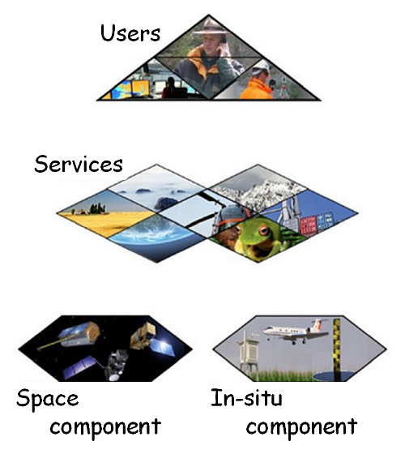

## The Copernicus programme

The Copernicus predecessor programme was the Global Monitoring for Environment and Security (GMES), which was launched in 1998 by the EU and ESA. In 2012 it was renamed Copernicus and transferred.

The Copernicus core services provide comprehensive basic information that can be further processed for a variety of applications.
The programme consists of the following six core services:
- [Copernicus Land Monitoring Service, CLMS](https://land.copernicus.eu/)
- [Copernicus Marine Environment Monitoring Service, CMEMS](http://marine.copernicus.eu/)
- [Copernicus Emergency Management Service, EMS](https://atmosphere.copernicus.eu/)
- [Copernicus Atmosphere Monitoring Service, CAMS](https://atmosphere.copernicus.eu/)
- [Copernicus Climate Change Service, C3S](https://climate.copernicus.eu/)
- [Copernicus Security](https://www.copernicus.eu/en/services/security)

In this learning unit, the focus will be on land monitoring.

! Information about the Copernicus core services can be found here: https://www.d-copernicus.de/daten/daten-eu-kerndienste/ and here https://www.copernicus.eu/en/services.
  

There are basically four project components within Copernicus:

- on the one hand the satellites and contributing missions as well as the ground segment,
- on the other hand the national in-situ measurement networks. Behind the in-situ component are all data that were not obtained from space (except data such as SRTM).
- the six thematic services, which are implemented by technical agencies such as the European Environment Agency (EEA).
- the resulting information is collected, processed and made available to end users. This includes government bodies and administrations, politics, science, commercial enterprises, start-ups or non-profit organisations and citizens ... resp. everyone.

Within the space component, satellite systems formof course the fundamental basis for Earth observation and environmental monitoring. Through permanent data supplies and new standards, Europe's position in international satellite remote sensing is to be strengthened. The planned construction of seven satellite systems/instruments will continue over the next years. This also means the expansion and development of ground segments and data platforms. In addition to the _Sentinels_ (guards), there is also an agreement with approx. 30 contributing missions, which include well-known satellite missions such as RapidEye, Landsat, SPOT, Pleiades, WorldView, GeoEye, ALOS/PALSAR, TerraSAR-X, TanDEM-X.
  

The Sentinel fleet includes:
- Sentinel-1 offers all-weather, day and night radar images for land and sea services.
- Sentinel-2 offers high-resolution optical images for land cover and water.
- Sentinel-3 provides high-precision optical, radar-based and altimetric data for shipping and land transportation.
- Sentinel-4 and Sentinel-5 will provide data for monitoring atmospheric composition from geostationary and polar orbits, respectively.
- Sentinel-5P (Precursor) closes the gap between Envisat and Sentinel-5.
- Sentinel-6 will provide radar altimetry data to measure the global elevation of the sea surface, mainly for operational oceanography and climate studies.

! Further information on the individual satellites of the Copernicus programme can be found on the [German] (https://www.d-copernicus.de/daten/daten-sentinels/) and [English Copernicus pages] (http://www.copernicus.eu/main/sentinels) as well as at the [ESA] (https://www.esa.int/Our_Activities/Observing_the_Earth/Copernicus/Overview4).

## The first three "guards"

__Sentinel-1__

  

__Sentinel-2__

  

__Sentinel-3__

