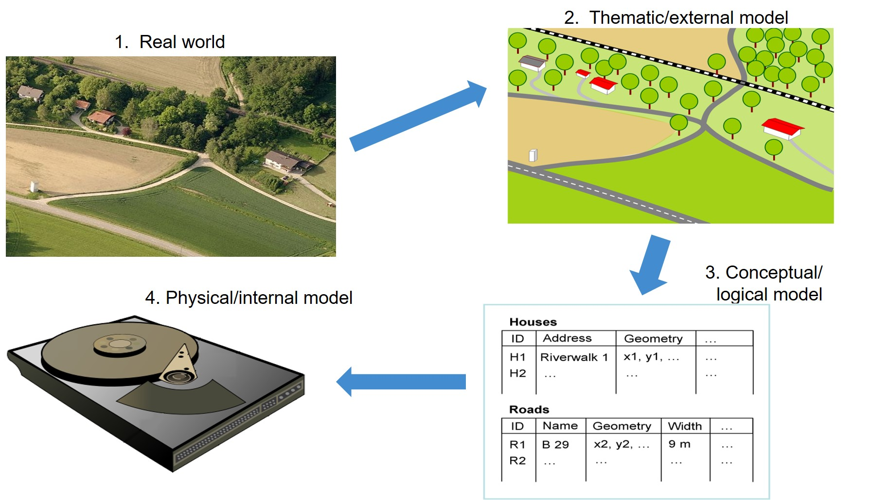

To address a spatially related question, a section of the real world is viewed from a technical point of view and described in significant object classes from the point of view of the technical use (called thematic or external model) (see figure).

**Thematic or external modeling** means the description, processing and storage of the underlying theme of a spatial object. Thematic modeling always depends on the application. However, basic concepts and commonalities can be found in many different problems. Object-related models have established themselves for thematic modeling. The so-called object class principle is used here, in which a graph is created which, in the simplest case, represents a tree. The branching of the tree upwards can be arbitrary, i.e. a complex object class is superimposed on an object class. Thematic or external modeling means the description, processing and storage of the underlying theme of a spatial object. Thematic modeling always depends on the application. However, basic concepts and commonalities can be found in many different problems. Object-related models have established themselves for thematic modeling. The so-called object class principle is used here, in which a graph is created which, in the simplest case, represents a tree. The branching of the tree upwards can be arbitrary, i.e. a complex object class is superimposed on an object class. 

The thematic models are modeled in the con**ceptual/logical model** in an application schema, e.g. in their static behaviour by using UML class diagrams (Unified Modeling Language) and in a form understandable for databases (e.g. by means of entity relation models) and stored in the database in the form of tables. The actual physical storage on servers and hard disks is defined in the **physical/internal model** (Bill, 2016, p. 19ff.).
